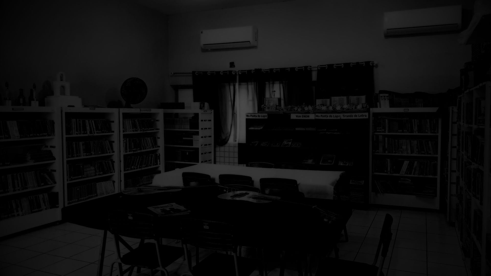

<div align="center">
  <br />
  
  <h1>LibraryHub</h1>
  <p><strong>Plataforma Open Source de Gestão de Acervos Educacionais, Livros Digitais e Trabalhos Acadêmicos</strong></p>

  <p>
    <a href="#-licença"></a>
    <a href="#-tecnologias"></a>
    <a href="#-tecnologias"></a>
    <a href="#-tecnologias"></a>
    <a href="#-tecnologias"></a>
    <a href="#-acessibilidade"></a>
    <a href="#-status-do-projeto"></a>
  </p>

  <p>
    <a href="#-funcionalidades">Funcionalidades</a> •
    <a href="#-guia-de-instalação">Instalação</a> •
    <a href="#-documentação">Documentação</a> •
    <a href="#-docker">Docker</a> •
    <a href="#-contribuição">Contribuição</a> •
    <a href="#-licença">Licença</a>
  </p>
  <br />
</div>

---

## 📖 Sobre o Projeto

O **LibraryHub** é uma solução completa e moderna desenvolvida para transformar a experiência de gestão e acesso a bibliotecas escolares e acervos acadêmicos. Com uma interface envolvente, leitor imersivo de PDFs, controle administrativo por níveis de acesso (RBAC), histórico de leitura e recomendações dinâmicas por turma, o sistema oferece um ambiente digital de aprendizado acessível de qualquer dispositivo.

---

## ✨ Funcionalidades Principais

### 📚 Gestão de Livros & Acervo Digital
- **Catálogo Interativo**: Navegação por categorias, autores, ano de publicação e recomendações populares.
- **Leitor Imersivo de PDFs**: Leitura em tela cheia com salvamento automático da última página lida e percentual de progresso.
- **Favoritos & Histórico**: Armazenamento de livros salvos pelo leitor e registro do histórico recente de leitura.

### 🎓 Trabalhos de Conclusão de Curso (TCCs)
- **Repositório Acadêmico**: Indexação de TCCs escolares com busca por orientador, curso, palavras-chave e resumo.
- **Streaming & Miniaturas**: Visualização de capas e leitura de monografias diretamente no navegador.

### 💬 Resenhas & Moderação
- **Avaliações com Estrelas**: Estudantes podem avaliar obras com notas de 1 a 5 estrelas e comentários.
- **Painel de Moderação**: Bibliotecários e moderadores revisam, aprovam ou rejeitam avaliações antes da publicação.

### 📊 Painel Administrativo & Analytics
- **Gestão de Usuários**: Cadastro, edição de cargos (Aluno, Bibliotecária, Orientador, Desenvolvedor) e redefinição de senhas.
- **Analytics por Turma**: Destaques de livros e TCCs mais consultados por séries e turmas escolares.

### ♿ Acessibilidade & Experiência (UX)
- **Modos de Tema**: Suporte a Tema Claro, Tema Escuro e Alto Contraste (WCAG AA Compliant).
- **Navegação por Teclado**: Suporte total a anel de foco visível (`:focus-visible`) e atalhos (`Ctrl+K` para busca rápida).
- **Notificações Toast**: Sistema de alertas visuais instantâneos.

---

## 🎨 Capturas de Tela

<div align="center">
  <table width="100%">
    <tr>
      <td width="50%" align="center">
        
        <br /><sub><b>Hero Banner & Acesso Rápido</b></sub>
      </td>
      <td width="50%" align="center">
        
        <br /><sub><b>Leitor Imersivo de PDFs</b></sub>
      </td>
    </tr>
  </table>
</div>

---

## 🛠️ Tecnologias Utilizadas

### Frontend
- **Framework**: [React 18](https://react.dev/) + [Vite](https://vitejs.dev/)
- **Linguagem**: [TypeScript 5](https://www.typescriptlang.org/)
- **Roteamento**: [React Router DOM v6](https://reactrouter.com/) (Code Splitting via `React.lazy`)
- **Estilização**: Vanilla CSS (Design Tokens, Variáveis CSS, Glassmorphism)
- **Ícones**: [Lucide React](https://lucide.dev/)
- **Leitor de PDF**: [PDF.js](https://mozilla.github.io/pdfjs/)

### Backend
- **Ambiente**: [Node.js 20](https://nodejs.org/)
- **Framework REST**: [Express.js](https://expressjs.com/)
- **ORM**: [Prisma ORM 5](https://www.prisma.io/)
- **Banco de Dados**: [SQLite](https://www.sqlite.org/)
- **Autenticação**: JSON Web Tokens (JWT) + bcryptjs
- **Logs**: Winston Logger com suporte a anonimização de IPs (LGPD)
- **Testes**: [Vitest](https://vitest.dev/) + Supertest (52 testes de integração)

---

## 🚀 Guia de Instalação

### Pré-requisitos
- **Node.js**: versão `20.x` ou superior
- **npm**: versão `10.x` ou superior

### 1. Clonando o Repositório
```bash
git clone https://github.com/libraryhub/libraryhub.git
cd libraryhub
```

### 2. Configurando o Backend
```bash
cd backend
npm install
cp .env.example .env
npx prisma db push
npm run dev
```

### 3. Configurando o Frontend
```bash
cd ../frontend
npm install
npm run dev
```

Acesse a aplicação em `http://localhost:5173`.

---

## 🐳 Docker & Docker Compose

Para executar toda a pilha de aplicação com contêineres:

```bash
docker-compose up -d --build
```

A aplicação estará acessível em `http://localhost:3333`.

---

## 📚 Documentação Adicional

Acesse a documentação detalhada na pasta [`docs/`](./docs/):
- 📐 [Arquitetura do Sistema](./docs/architecture.md)
- 🔌 [Especificação da API REST](./docs/api.md)
- 🗄️ [Modelo do Banco de Dados](./docs/database.md)
- 🚀 [Guia de Deploy em Produção](./docs/deployment.md)

---

## 🤝 Contribuição

Contribuições são super bem-vindas! Consulte nosso [Guia de Contribuição](./CONTRIBUTING.md) para entender o fluxo de Pull Requests e os padrões de commits.

---

## 📜 Licença

Este projeto é um software livre licenciado sob a [Licença MIT](./LICENSE).
