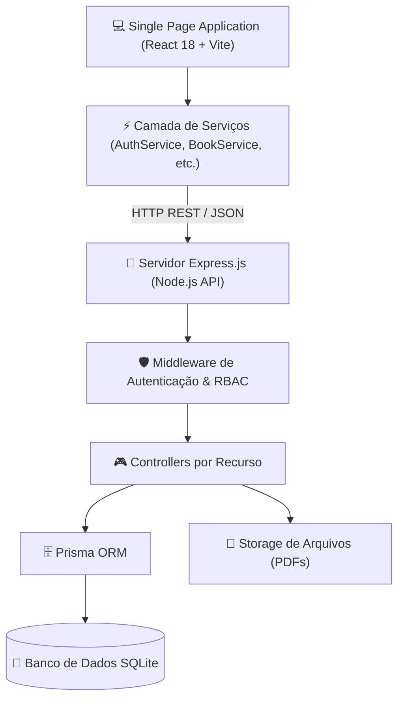
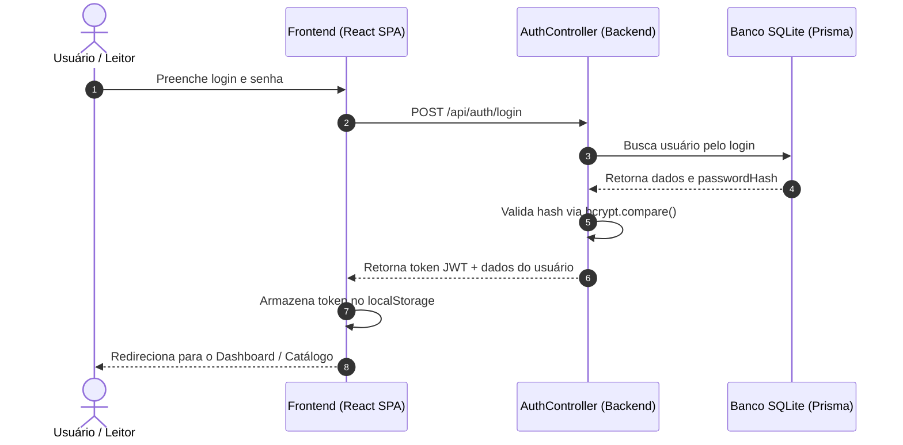

# Arquitetura do Sistema — LibraryHub

O **LibraryHub** é uma plataforma moderna desenvolvida sob o modelo de **Monolito Modular Desacoplado**, separando claramente a camada de apresentação no cliente (SPA React) do servidor de aplicação e APIs (Express.js REST).

---

## 📐 Visão Geral da Arquitetura



---

## 🔐 Fluxo de Autenticação (JWT + LocalStorage)



---

## 📁 Organização de Pastas do Frontend

```
frontend/src/
├── app/            # Roteador, provedores globais e inicialização
├── assets/         # Imagens estáticas e recursos visuais
├── components/     # Sistema de Design (UI) e componentes compartilhados
│   ├── ui/         # Botões, Modais, Skeletons, Toasts, Inputs
│   ├── layout/     # Navbar, Sidebar, Footer, MainLayout
│   └── common/     # UserAvatar, BookCard, TCCCard
├── features/       # Módulos por Domínio/Funcionalidade
│   ├── authentication/
│   ├── books/
│   ├── tccs/
│   ├── reviews/
│   ├── users/
│   ├── moderation/
│   └── profile/
├── hooks/          # Custom hooks reutilizáveis (useAuth, useBooks, useToast)
├── services/       # Camada isolada de comunicação com a API REST
├── constants/      # Mapeamentos e constantes centralizadas
└── types/          # Interfaces e declarações TypeScript
```
