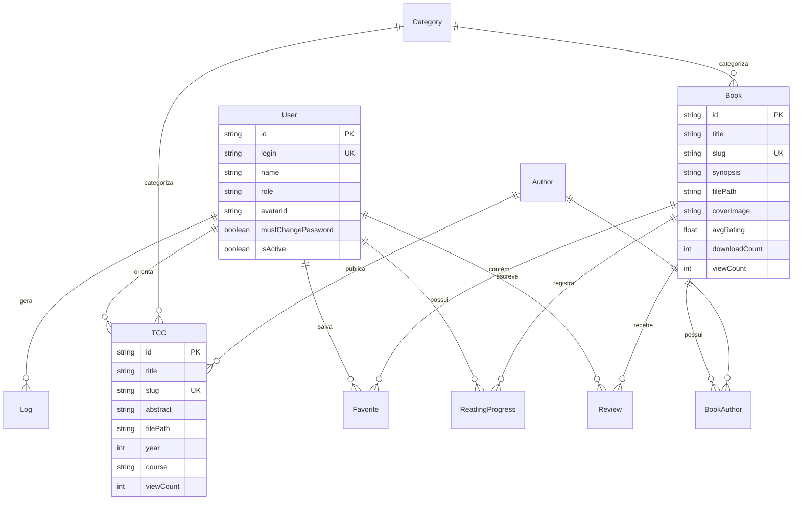

# Modelo do Banco de Dados — LibraryHub

O **LibraryHub** utiliza o **Prisma ORM** integrado ao banco de dados relacional **SQLite** em ambiente de produção e desenvolvimento.

---

## 📊 Diagrama Entidade-Relacionamento (ER)

